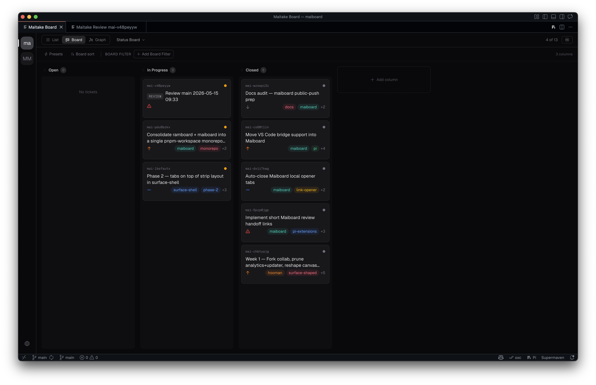
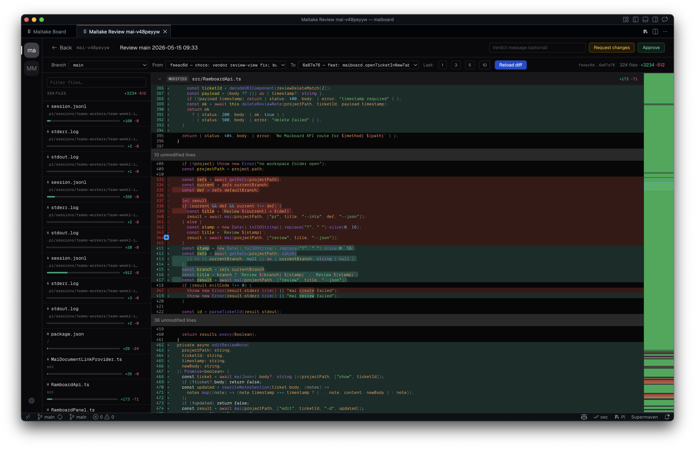

<p align="center">
  
</p>

<h1 align="center">🍄‍🟫 maiboard</h1>

<p align="center"><strong>A visual board and review workbench for <a href="https://github.com/Cygnusfear/maitake">Maitake</a>. Markdown-native tickets, drag-and-drop kanban, in-editor reviews.</strong></p>

<p align="center">
  <a href="#features">Features</a> ·
  <a href="#install">Install</a> ·
  <a href="#packages">Packages</a> ·
  <a href="https://github.com/Cygnusfear/maitake">Maitake</a>
</p>

---

**maiboard** is a Bun workspace that ships a VS Code/Codium extension, a standalone web board, and a `mai board` plugin. All three read the same `.tickets/` directory `mai` writes — every drag, edit, or review verdict is still a plain-text commit in your repo.

> **Status:** early. APIs and storage are still moving. Run it from this monorepo for now.

## Features

### Board

<p align="center">
  
</p>

Drag-and-drop kanban over your `mai` tickets. List, Board, and Graph layouts. Status columns, tag chips, saved views, group-by status/type/epic, board sort and filter presets. No separate database — the source of truth is your repo's `.tickets/` directory.

### Review

<p align="center">
  
</p>

In-editor code reviews driven by `mai review` tickets. Pick a base, pick a head, scrub the last 1 / 3 / 5 / 10 commits, inspect file-level diffs with syntax highlighting, leave a verdict message. **Approve** or **Request changes** — either way the verdict round-trips back into the ticket as an audited comment.

## Prerequisites

- [Bun](https://bun.sh) ≥ 1.3
- [Maitake (`mai`)](https://github.com/Cygnusfear/maitake) installed and on `$PATH`
- VS Code or [VSCodium](https://vscodium.com) 1.110+ (only for the extension)

## Install

```bash
git clone https://github.com/Cygnusfear/maiboard
cd maiboard
bun install
bun run typecheck
bun run lint
bun run build
bun run package:vscode
```

## Packages

| Package                              | Description                                                                        |
| ------------------------------------ | ---------------------------------------------------------------------------------- |
| [`packages/board`](packages/board)   | Vite + React board UI (List / Board / Graph views).                                |
| [`packages/server`](packages/server) | Bun HTTP API server. Shells out to `mai` for ticket reads/writes.                  |
| [`packages/cli`](packages/cli)       | `mai-board` binary. Direct launcher and the `mai board` plugin entry are the same. |
| [`packages/api`](packages/api)       | Shared TypeScript-only route/domain types. Zero runtime deps.                      |
| [`packages/vscode`](packages/vscode) | VS Code / Codium extension (`pi0.maiboard`). Reimplements the API in-process.      |

## VS Code / Codium packaging

The extension vendors the board build into `packages/vscode/vendor/board` at build time, so the vsix is self-contained except for `mai` and `git` on the user's `PATH`:

```bash
bun run package:vscode
codium --install-extension packages/vscode/maiboard-0.3.1.vsix --force
```

Reload the Codium window after installing a new vsix.

## mai-board plugin registration

No postinstall hooks mutate global state. Register explicitly:

```bash
bun run --filter mai-board dev -- --register
```

That writes `board = "mai-board"` to `~/.maitake/plugins.toml` if needed. After the binary is on `PATH`, `mai board` resolves to `mai-board`.

## License

[MIT](./LICENSE). See also the upstream [Maitake](https://github.com/Cygnusfear/maitake) project this builds on.
